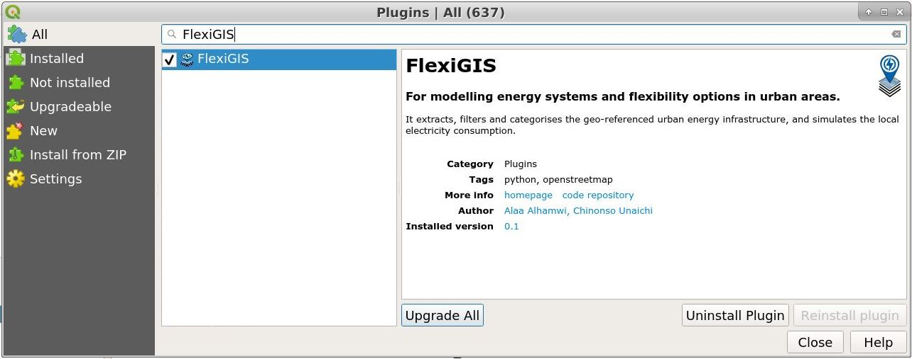

# FlexiGIS-Plugin: An open source GUI for the replication of urban energy infrastructure.


## FlexiGIS-plugin: 

It is a QGIS plugin that serves as a graphical user interface (GUI) of the [FlexiGIS](https://github.com/FlexiGIS) including [FlexiGIS-light](https://github.com/FlexiGIS/FlexiGIS_light) tools. This plugin is ready to be used, available to download and can be installed directly from the QGIS Plugin Manager within the [QGIS](https://www.qgis.org/en/site/) Desktop. FlexiGIS-Plugin introduces some of the FlexiGIS functionalities which are summerised in theree main steps. First, it extracts the raw datasets of the urban energy infrastructure from the [OpenStreetMap](https://www.openstreetmap.org/). Then, it geopreccess, clusters and c the extracted urban datasets, and finally simulates the electricity consumption in the respective city or district.

[](https://doi.org/10.5281/zenodo.4497218)


Fig. 1. A screen-shot of the first version of the FlexiGIS-GUI as a QGIS plugin.

## Installation:

This plugin can be directly installed from the QGIS Plugin Manager within the QGIS application.
It can be also installed manually in the QGIS desktop by following the steps mentioned below. 

**Note that this first version of the FlexiGIS-plugin supports Linux Ubuntu systems. We are working on solutions for Windows platform.
In addtion, FlexiGIS is a GIS-based tool that uses mainly OSM data. Therefore, FlexiGIS-plugin needs the following tools and packages: [Osmosis](https://github.com/openstreetmap/osmosis#installation), [OSMfilter](https://wiki.openstreetmap.org/wiki/Osmfilter) and [GDAL](https://gdal.org/download.html) installed in your Linux Ubuntu.**

- Clone the plugin repository (since the repo is not public yet, you will be ask for the flexigis github account username and password)

```console
terminal:~$ https://github.com/FlexiGIS/FlexiGIS-plugin.git
```

- cd into the FlexiGIS-plugin directory and copy the  *flexigis* folder to yours QGIS3 python path.

``` 
terminal/FlexiGIS-plugin:~$ cp -r flexigis ~/.local/share/QGIS/QGIS3/profiles/default/python/plugins
```

After following the above steps, start your QGIS3 deskop environment. First install plugin reloader, this is used to reload any installed plugin in QGIS. To reload the flexgi_plugin, ensure you can see it on the list of installed plugins in your QGIS3 (Plugin management section).

In your QGIS menu bar go to: plugins > Manage and install plugins > installed (to check installed plugin). To ensure that the newly created plugin is present in the QGIS plugin path.

To reload plugin go to the plugin reloader icon, click on the drop down menu, select configuration, then select the plugin you want to reload. In our case we select the 'flexigis_plugin'. The final hit the reload icon of the plugin reloader. This is done any time the plugin backed or front end codes are edited. See further documentation [here](https://github.com/FlexiGIS/FlexiGIS-plugin/blob/master/flexigis/help/source/index.rst).

## Dependencies

- python >=3.5
- pandas
- gdal 
- osmfilter
- osmosis

*NOTE: you can check your QGIS3 python version by running the below commands on your QGIS python terminal*

````
import sys
sys.version
````

## License

FlexiGIS-Plugin is licensed under the [BSD-3-Clause](https://opensource.org/licenses/BSD-3-Clause), "New BSD License" or "Modified BSD License".

Please see the file [LICENSE.md](LICENSE.md) for further information about how the content is licensed.

Furthermore, the OpenStreetMap (OSM) data are available under the Open Database License (ODbL). A description of the ODbL license is available [here](http://opendatacommons.org/licenses/odbl). OpenStreetMap cartography is licensed as CC BY-SA. For more information on the copyright of OpenStreetMap please visit [here](http://www.openstreetmap.org/copyright).

## Contact

Main author: Alaa Alhamwi alaa.alhamwi@dlr.de

Project maintainer: Chinonso Unaichi chinonso.unaichi@dlr.de

Organisation: German Aerospace Center - DLR Institute of Networked Energy Systems
